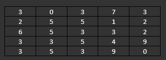

# oligo-chains

Pick any language, any platform (Java, SQL, C++, Python, VBA,  Camstar business rule, Matlab, SysML, 6502 assembly…)

Oligo chains are made up of sequences: GCTTAGGA etc. The number of bases determines the chain length. GTTA is smaller than GATTATA. 4 bases vs 7 bases.

Ion coupling with oligo chains has been identified as a new flowcell failure mode. This can only happen when an ion can travel  from outside of the flowcell, either along a column or row and from a shorter to a taller oligo chain. Taller to shorter or same height to same height cannot occur. Diagonal movement is also not possible.

The oligo chain length on a flowcell has been measured with the following results:

For example, the 4 bases length oligo in the lower right area is not susceptible to this failure mode.

Create an program that can calculate the likely yield of uncoupled oligos on this flowcell.

Could it be scaled to larger array sizes?

Send me your entries. We’ll evaluate on the following (where possible):

- Source code size (lower the better)
- Compiled file size (lower the better)
- Rube Goldberg quotient (the more elaborate/creative the better)
